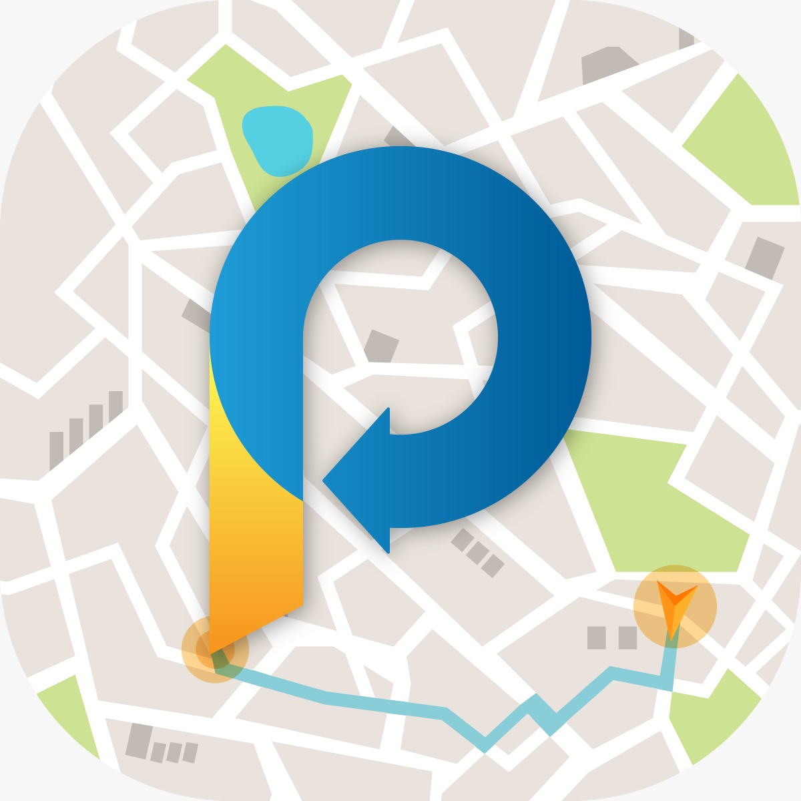

# WePark

Hello everyone,

This is WePark

## Who we are?
WePark offers a new alternative to changing the experience of finding parking in the modern world in which we live.
Today, when traveling to any destination has become a very simple task by using the Waze app and traveling from place to place using autonomous vehicles has become a reality,
solving the parking problem, which has existed for years and is considered an impossible task,
is becoming increasingly possible.

## Our solution
The system is a social platform that will help drivers get a given status on possibility finding an open parking space and,
through it each user will be able to know what the average time it takes for drivers to find parking in the area.
The driver will accordingly select his preferred parking area according to distance indices from the driver's location and the average time for searching for parking in that area.

Thanks for reading.

## Made by
    Lior Trachtman - Client side
    Avraham Rada - Backend side